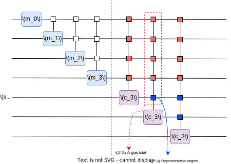

# MARIN-SANCHEZ et al. (2021) - Quantum Algorithms For Approximate Function Loading
## DOI: 10.1103/PhysRevA.107.022421

This repo contains the implementation of the replicate 
and modified version of the MARIN-SANCHEZ et al. Method for 
defining an ansatz for approximate function loading.

## Version 0.1
### Implementing the replicate and modification prototype

For both replicate and modified version, the procedure navigates the angle tree by each level $i \in [0, n]$ , and constructs a mutiplexor of the angles at the $i$-th level.

Instead of using a sequence of multicontrolled rotations we utilized [SHENDE et al. (2004)](https://arxiv.org/abs/quant-ph/0406176) for multiplexing the angles.

For creating the ansatz, we multiplexed generic `Parameter` objects available at the `Qiskit` library and we saved their corresponding values in the class attribute `init_params`.

We computed a $k_0$, which indicates what target qubit the construction of the multiplexors are to be truncated and, consequently, what level of the angle tree the parameters are to be clustered in a representative angle. The value $k_0$ is defined as follows (See Eq. 10 of [MARIN-SANCHEZ et al. (2021)](https://journals.aps.org/pra/abstract/10.1103/PhysRevA.107.022421)): 

$$
 k_0 = max \left\{\left\lceil -\frac{1}{2} log_2\left(-\frac{96}{\eta^2}log(1-\epsilon)\right) \right\rceil, 2 \right\}
$$

For some fidelity loss $\epsilon$ and some $\eta \in [0, 8\pi]$.

The angles are clusterized differently for either replicate or modified version.

- Replicate:
    - The angles are clusterized in a single representative angle for each tree level. The representative angle is used in a single-qubit rotation
- Modification
    - For a qubit $q \in [k_0, n-1]$, the angles of each tree level are clusterized according to the number of representative angles to be multiplexed.
    The following image demonstrates what is taken into account for computing the representative angles.

        
    
    The qubits in $[k_0, n-1]$ are used to determine how many representative angles should be computed from the angles at the $i$-th angle tree level.